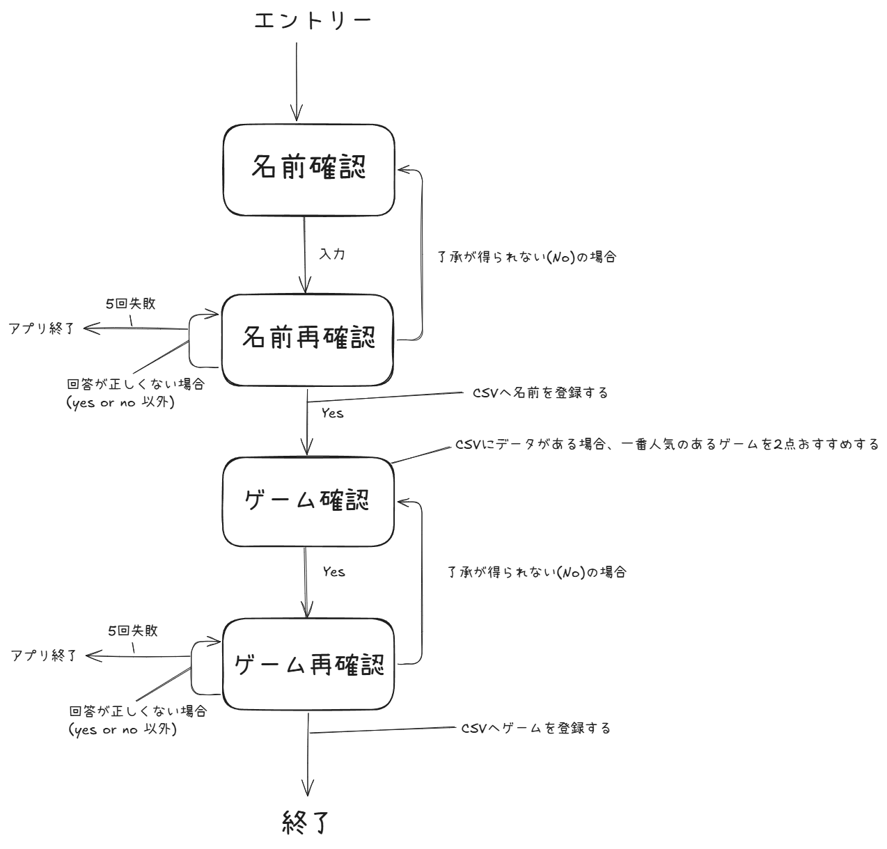

1. アプリ概要 \
アプリ名：Roboter \
開発環境：Python 3.10 \
内容： \
・簡単な対話アプリ \
・ユーザーの名前を確認して、CSVファイルへ記録する。 \
~~・GUI上でキャラクターが案内する~~

2. 機能

| No. | 機能            | 説明                  | 実装状況 | 日付   |
|-----|---------------|---------------------|------|------|
| 1   | 名前の確認         | ユーザーの名前を確認          | 完了   | 2/11 |
| 2   | 名前の再確認        | ユーザー名を再確認してyesかnoで回答を求める | 完了   | 2/14 |
| 3   | 名前の登録         | CSVへ名前を登録する         | 完了   | 2/14 |
| 3   | おすすめゲームの確認    | ゲーム名を確認             | 完了  | 2/17 |
| 4   | ゲームの再確認       | ゲームを再確認してyesかnoで回答を求める | 完了   | 2/17     |
| 5   | ゲームの登録        | CSVへゲームを登録する        | 完了   | 2/17     |
| 6   | 回答が正しくない場合の分岐 | 再確認時に回答が正しくない場合、アプリを終了する | 完了  |  2/17    |
| 7   | 人気のおすすめゲームの表示 | CSVにある人気ゲームを２つ表示する  | 完了  | 2/17     |

